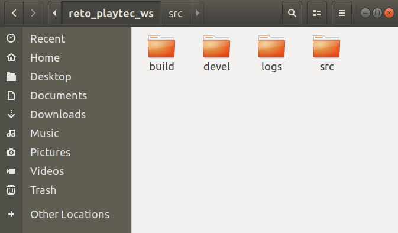

# Documentación del avance y/o problemas

## Reto - Parte 1

### 1) Creación del espacio de trabajo (workspace) de ROS: reto_playtec_ws/src<br><br>

Lo primero es crear la carpeta del espacio de trabajo `reto_playtec_ws` que incluya otra carpeta llamada `src`, usando el siguiente comando:

`$ mkdir -p -v ~/reto_playtec_ws/src`

Una vez creadas estas carpetas, iremos a una ubicación dentro de la carpeta `reto_playtec_ws` y usaremos el comando `catkin build` para construir el espacio de trabajo de ROS.

```
cd ~/reto_playtec_ws
catkin build
```

Lo que hizo el comando `catkin build` fue convertir la carpeta `reto_playtec_ws` en un espacio de trabajo de ROS a través de la generación de distintos archivos y carpetas. Así luce un espacio de trabajo de ROS:

<br>

### 2) Creación del paquete reto_ros dentro del workspace reto_playtec_ws/src<br><br>

Primero iremos a la ubicación `src` dentro del workspace `reto_playtec_ws`, luego vamos a usar el comando `catkin_create_pkg` para crear el paquete `reto_ros`. Este paquete tendrá a `roscpp`, `rospy`, `std_msgs` y `sensor_msgs` como dependencias.

```
cd ~/reto_playtec_ws/src
catkin_create_pkg reto_ros roscpp rospy std_msgs sensor_msgs
```

Una vez creado el paquete `reto_ros`, iremos a la ubicación dentro de este paquete. Acá, vamos a crear los directorios  `/launch`, `/urdf` y `/src`.

```
cd ~/reto_playtec_ws/src/reto_ros
mkdir -v launch urdf src
```
<br>

Finalmente lo último que tenemos que hacer es construir el workspace usando el comando `catkin build` desde cualquier ubicación dentro del workspace.

```
cd ~/reto_playtec_ws
catkin build
```

### 3) Creación de los Nodos


<br>
<br>
<br>
<br>
<br>
<br><br>
<br>
<br><br>
<br>
<br><br>
<br>
<br><br>
<br>
<br><br>
<br>
<br><br>
<br>
<br><br>
<br>
<br>
<br>
<br>
<br><br>
<br>
<br><br>
<br>
<br><br>
<br>
<br><br>
<br>
<br><br>
<br>
<br><br>
<br>
<br>
